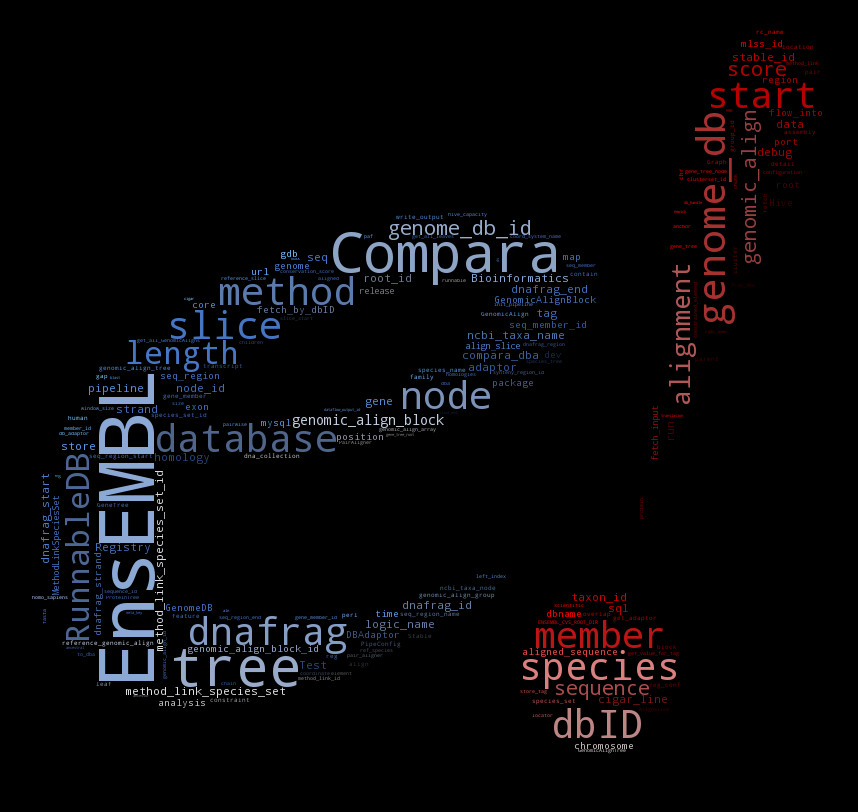

# Tutorial

The tutorial is the same as found on the [Ensembl website](http://www.ensembl.org/info/docs/api/compara/compara_tutorial.html) and is provided here for offline use.

# Workshop materials

The workshop materials relate to a workshop given in June 2016 in
Cambridge, on the version 84 of the API. Most of what is described is still
valid, but you may get warnings about deprecated methods.

Additional information can be found [online](http://www.ebi.ac.uk/~muffato/workshops/2016_06_Cambridge/)

