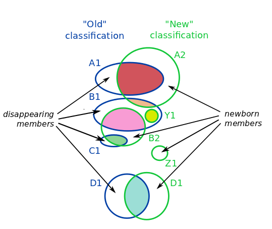

Stable-ID mapping
=================

About
-----

This document describes the procedure to map stable_ids in the
ensembl-compara pipeline.

It is used in the following mappings:

- EnsemblCompara GeneTrees 

  - stable_ids from release to release (ENSGT005600123456)
  - GeneTrees to external Treefam families

- EnsemblCompara MCL Families

  - stable_ids from release to release (ENSFM0056000123456)

The mapping procedure is based on the Maximum_name_reuse algorithm.

Algorithm description
---------------------

The algorithm takes two different classification schemes over a given
set of members.  It is assumed that the classifications are somehow
related, i.e. they tend to group members similarly. One is called
"old" and the other "new", given an order of succession.

The comparison requires a common namespace for the members used in
both classifications.  The algorithm then infers how the names of the
classes in two different classifications are related.

Namespaces:

- EnsemblCompara GeneTrees 

  - Common ENSEMBL translation stable_ids (ENSEMBLPEP) from release to release
  - Common ENSEMBL transcript stable_ids between GeneTrees and Treefam families

- EnsemblCompara MCL Families

  - Common Compara ENSEMBLPEP, Uniprot/SWISSPROT and Uniprot/SPTREML
    ids from release to release

With respect to the two given classsifications, we have three kinds of members:

- SHARED members (the ones present in both classifications)
- DISAPPEARING members (the ones present only in the "old" classification)

  - e.g. for the GeneTrees, gene predictions or complete genomes that disappear in
    the next release

- NEWBORN members (the ones present only in the "new" classification).

  - e.g. for the GeneTrees, new gene predictions or new complete
    genomes in the next release

The relationship between classes is inferred from the SHARED members,
but the other two kinds are also counted by the algorithm.

The algorithm iterates through the "new" classes in the descending
order of their sizes, trying to reuse a name of one of the "old"
classes from where the SHARED members come to the "new" class, and
make it the name of the "new" class, if it has not been taken yet.

#. If 100% SHARED members of the "old" class become 100% SHARED members
   of the new class, we call this case an EXACT reuse.

   .. note:: If there was only one SHARED member, we call it an EXACT_o for
      "orphan".

#. Otherwise we have a split/join situation and iterate through the
   "contributors" (the "old" classes from which the SHARED members come
   from) in the decreasing order of the sizes of the shared parts.
   This ordering insures that both in cases of joins and splits we are
   reusing the name of the biggest contributor:

#. If the "old" class name of the first (the biggest) part has not yet
   been taken, we take it and call this a MAJORITY reuse.  Due to the
   ordering (and looking at the statistics) this type of name reuse
   usually means that the SHARED *majority* of the biggest "old"
   contributor becomes the SHARED *majority* of the "new" class.

   .. note:: If there was only one SHARED member, we call it an MAJORITY_o for
      "orphan", although this will rarely happen.

#. If the "old" class name of the first part has been taken, but one of
   the other "old" class names is still free, we take it and call it a
   NEXTBEST name.  (these classes are usually very small, because the
   majority of the SHARED members participate in EXACT/MAJORITY cases).

#. If a name could not have been reused, because all the "old"
   contributor's names have been used, a completely new name is
   generated and it is a NEWNAME case.

   This usually means we are dealing with a split of a big class, where
   the majority has gone into an MAJORITY, and the rest of it needs a new
   name.

   .. note:: If there was only one SHARED member, we call it NEWNAME_o.

#. Finally, if we have a "new" class that only contains NEWBORN members
   (meaning there were no "old" classes to reuse the names from), again a
   new name is generated, but this is a NEWFAM case.

   .. note:: If the new class has only one (NEWBORN) member, it is a NEWFAM_o case.

In the example diagram:

* D1 is an EXACT reuse (cyan contributor)

* A2 inherits the name from A1 according to the MAJORITY rule (light
  red contributor)

* B2 inherits the name from B1 (pink contributor), and C1 name
  disappears in the new classification and it is merged into B2
  (light green).

* Z1 is created from NEWBORN members

* Y1 is an example of NEWNAME (yellow contributor)

Versioning
----------

A version increase indicates that the SHARED members have changed for
that class. The version is kept the same if it is an EXACT reuse
case. For example, in the GeneTrees:

#. If a genetree with 50 members in release 56 turns into a genetree
   with 49+2 members in release 57, 49 being SHARED and 2 being NEWBORN,
   the version will change.

#. If a genetree with 50 members in release 56 turns into a genetree
   with 48+2 members in release 57, 48 being SHARED and 2 being NEWBORN,
   the version will change, even though the total number of members is
   the same.

#. If a genetree with 48+2 members in release 56 turns into a genetree
   with 48 members in release 57, 48 being SHARED and 2 being
   DISAPPEARING (e.g. updated genebuild that deletes some members), the
   version will be the same.

#. If a genetree with 48+2 members in release 56 turns into a genetree
   with 48+3 members in release 57, 48 being SHARED, 2 being DISAPPEARING
   and 3 being NEWBORN, the version will be the same.

